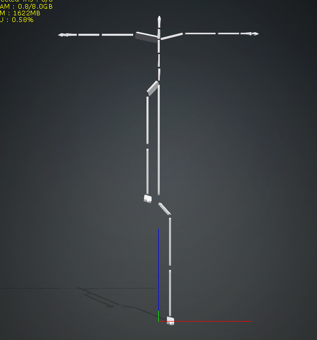
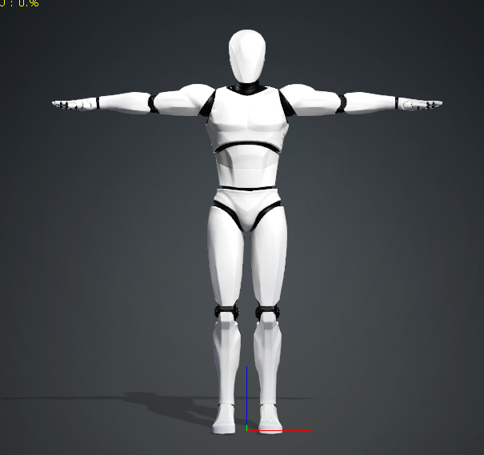
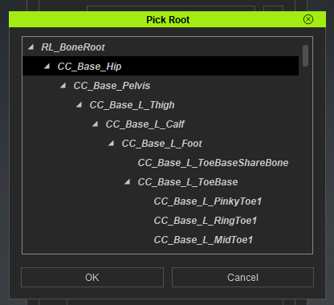
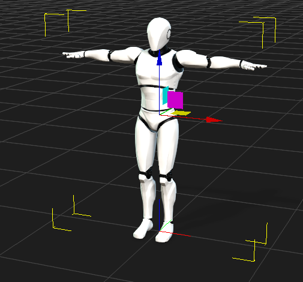
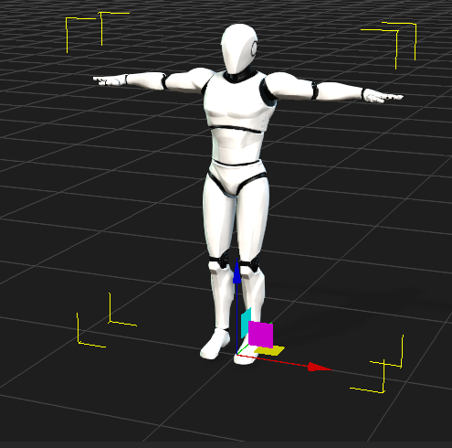

# IClone CMU Mocap

CMU Mocap Library directly converted to IClone for cleanup, editing, and retargeting.

Over the years since CMU created their motion capture library, it has been through many conversions.  These conversions have essentially been copies of copies of copies.  This project aims to bring the motion capture data as directly as possible from the original AMC files into IClone.

# What Has Been So Far (Batch Processing)
The AMC files were converted directly to BVH using Credo Interactive LifeForms.  This was a direct conversion so the data in the BVH files is exactly the same as the data in the AMC files with the exception that the frame time string is incorrect.

A T-Pose was created for each subject using the ASF skeleton by rotating the thigh of each leg 20 degrees and saved as a single frame BVH file.

The CMU database listing was converted to a CSV file that could be read by python pandas.

The fixfiles.py script located in the bvh fix script subdirectory was run on the bvh files.  It prepends the T-Pose to each motion and fixes the Frame Time based on the frame rate in the CSV file.

The raw BVH conversions are available on google drive at https://drive.google.com/drive/folders/1rRw_gqUW5LTD8JOimKLcMZkpvfAnAmQY?usp=sharing

- All_BVH_Raw.zip is the direct conversion.
- All_BVH-Fixed.zip is with the frame rate corrected and the T-Pose added.
- All_iClone.zip is the motions in rlmotion format that have been imported so far.

# Importing  into Character Creator
The double hip bone on the CMU rig causes some  visual, but harmless issues when importing into Character creator.  There will be a visual offset when the motion is imported onto the characterized rig.  This can be safely ignored.

- A motion (with t-pose) applied to the CMU rig

- The same motion (with t-pose) applied to the CMU rig

Before editing and cleanup, the motions should be exported back to BVH.  The Male motion dummy was selected as a donner for this.  No particular reason except that everyone who has IClone has that particular avatar and one had to be chosen for standardization.  When exporting from Character Creator 4, Select the hip as the root.  This corrects an error where the origin of the motion is at the hip rather than the root of the avatar when the motion is reimported.

- Selecting CC_Base_Hip for export

- Directly imported motion applied in iClone showing the root of the motion  at the hip.

- The same motion applied in iClone after reimporting from bvh with the motion root set to CC_Base_Hip showing the root of the motion  at the hip.

The last two fields of CMU data.csv are what has been done with each motion and who did the work.

# HumanIK Characterization
The bones are mapped from the CMU rig to the Character Creator HumanIK rig in the following way
- HipsNodeId -> lhipjoint
- LeftHipNodeId -> lfemur
- LeftKneeNodeId -> ltibia
- LeftAnkleNodeId -> lfoot
- LeftFootNodeId -> ltoes
- RightHipNodeId -> rfemur
- RightKneeNodeId -> rtibia
- RightAnkleNodeId -> rfoot
- RightFootNodeId -> rtoes
- WaistNodeId -> lowerback
- Spine1NodeId -> upperback
- Spine2NodeId -> thorax
- LeftCollarNodeId -> lclavicle
- RightCollarNodeId -> rclavicle
- NeckNodeId -> lowerneck
- Neck1NodeId -> upperneck
- HeadNodeId -> head
- LeftShoulderNodeId -> lhumerus
- LeftElbowNodeId -> lradius
- LeftWristNodeId -> lhand
- LdftMiddleANodeId -> lfingers
- LeftThumbANodeId -> lthumb
- RightShoulderNodeId -> rhumerus
- RightElbowNodeId -> rradius
- RightWristNodeId -> rhand
- RightMiddleANodeId -> rfingers
- RightThumbANodeId -> rthumb

# Why BVH for the repository
Before pushing to the repository after editing, the motions are exported to BVH on the Motion Dummy Male avatar with the default options.  IClone's motion format is binary which is not optimal for revision control. BVH is an industry standard text format.  Text formats work well with revision control.
